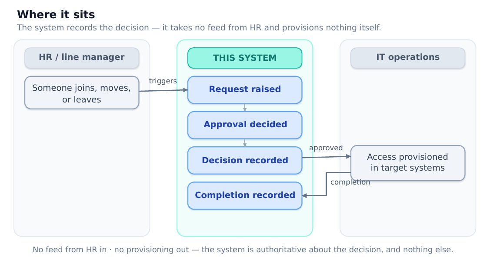

# Part 1 — Use Case

## The problem

When someone joins, changes role, or leaves, their system access has to change with them. In most organisations that runs on email and conversation, and the consequences are predictable: nobody can say who approved what, provisioning is late, leavers keep access after their last day, and when an auditor asks for evidence the honest answer is a mailbox search.

The root cause is not carelessness. It is that the process has no single source of truth. An email thread is not a record — not structured, not searchable, not complete, and owned by nobody once it goes quiet.

## What this system does

It makes the request itself the source of truth.

A requester raises a request: who it is for, whether they are joining, moving or leaving, which systems, when, and who should approve it. An approver approves or rejects it, and the decision is stamped with who took it and when. Once IT has provisioned the access, the request is explicitly marked completed.

One authoritative record per access decision — an audit trail of who asked, who approved, which systems, and when.

The record is the point. Every design decision follows from treating the request row as audit evidence rather than a task ticket — which is why employees with request history cannot be deleted, why withdrawing changes a status rather than removing a row, and why a decision cannot be revised.

## Who uses it

| Role | Does | Cannot |
| --- | --- | --- |
| Requester | Raises and tracks requests; edits or withdraws their own | Change anything after a decision |
| Approver | Decides requests nominated to them; marks provisioning complete | Approve their own request, or re-decide one |
| Administrator | Django admin, for the system and department catalogues and corrections | — (deliberately outside the request lifecycle) |

There is no anonymous role. Every page requires authentication; there is no public dashboard and no unauthenticated read path.

## What “done” looks like

- Every access decision has a record — who asked, who approved, when, which systems.

- Decided requests are immutable through the application; nothing is hard-deleted.

- Approval rules are enforced by the system, not by convention.

- An approver can see what needs them without hunting.

- Evidence survives the people: deleting an employee or user is blocked while requests reference them.

## Scope

In scope — recording requests across the joiner/mover/leaver lifecycle; a guided multi-step create path and a simpler draft path; enforced approval rules, including under concurrent decisions; a dashboard with an approver queue; full read and write paths.

Out of scope, deliberately:

| Excluded | Why |
| --- | --- |
| Real provisioning (AD, Graph, LDAP) | The system records intent and approval. Provisioning happens outside and is recorded by an explicit action. |
| Background task queues | Nothing in the workflow is asynchronous. A broker and worker would be infrastructure with no requirement behind it. |
| Multi-tenancy | One deployment, one organisation. Tenant isolation complicates every query in the system. |
| A real mover diff | Computing add-versus-remove needs current entitlements, which needs integration, which is excluded above. |
| Anonymous access of any kind | Including public aggregate views. |

A system that promises provisioning and does not deliver it is worse than one that never promised. The boundary is drawn so every claim the application makes is one it can keep: it claims to record decisions, and it does.

## Constraints

- One codebase, many environments — laptop, self-hosted server and managed platform differ only by configuration.

- PostgreSQL everywhere, including local development. Developing on one engine and deploying on another is how engine-specific defects survive to production.

- Clarity over cleverness. The code is meant to be read and defended aloud.

- No secrets in version control, no customer-identifying data in the public repository.

## Where it sits

It deliberately does not extend either way: it consumes no HR feed, and it provisions nothing. That narrow footprint is what makes the audit claim credible — authoritative about one thing, honest about the rest.
