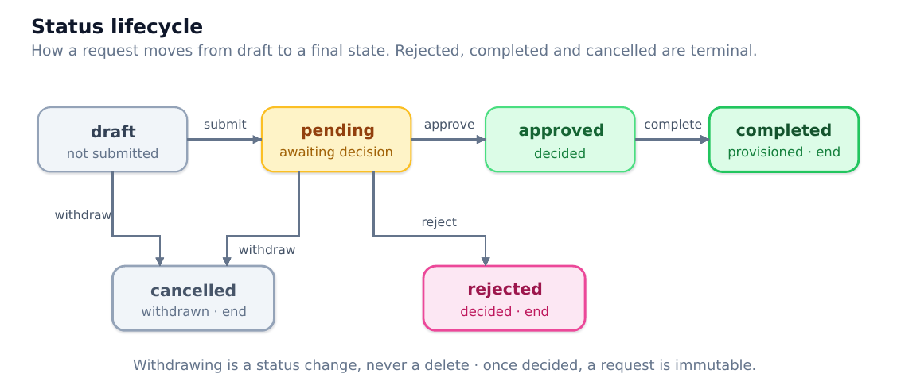
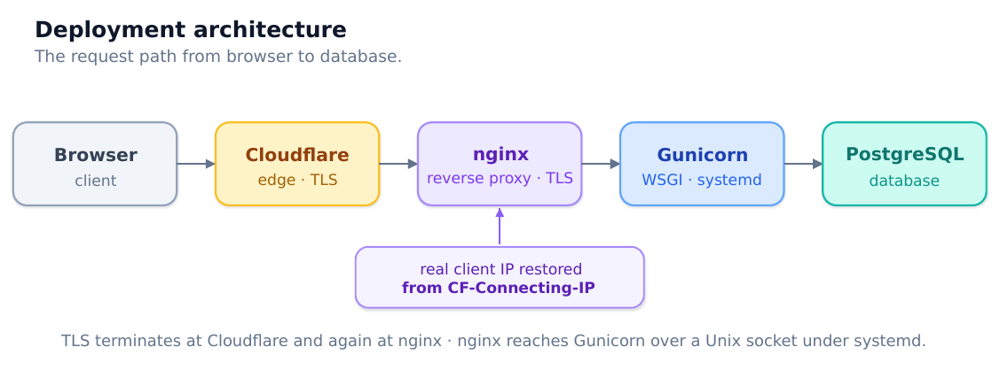

# Part 2 — Technical Design

## Stack

| Layer | Choice | Why |
| --- | --- | --- |
| Language | Python 3.12 | — |
| Framework | Django 5.2 LTS | Security support to 2028. A non-LTS release would need a framework upgrade inside the support window of a portfolio piece. |
| Database | PostgreSQL 16 | Real constraints, real transactions, real row locking — all three are load-bearing here. |
| Driver | psycopg 3 | Current generation. |
| Config | django-environ | Parses DATABASE_URL and casts types; one line instead of hand-rolled parsing. |
| Static | WhiteNoise | Serves static from the application, so the same code runs with or without a web server in front. |
| WSGI | Gunicorn | Under systemd in production. Never runserver. |

Idiom: function-based views, ModelForms and sessions. No class-based views. Every request path is a function that can be read top to bottom without resolving an inheritance chain — which is the point when the code has to be explained aloud.

## Configuration

Nothing environment-specific is hardcoded. DEBUG, SECRET_KEY, ALLOWED_HOSTS, CSRF_TRUSTED_ORIGINS, the TLS flags and the database all read from the environment.

Where a default would be dangerous, there is none. SECRET_KEY and DATABASE_URL are required; an unset value raises ImproperlyConfigured and stops the process. In particular there is no SQLite fallback — a silent fallback would let the application run locally on an engine it never ships on, which is exactly how engine-specific defects stay hidden until deployment day.

DEBUG defaults to False, so forgetting it fails closed.

DATABASE_URL is the single database lever: moving between a local Postgres, the server’s, and a hosted one is a configuration change and nothing else.

## Data model

Four tables.

System — an application or entitlement. name (unique), category, is_active. Retired systems are deactivated, never deleted: historic requests must keep naming the system they were actually raised against.

Department — a curated lookup. name (unique), is_active. An administrator maintains the list; everyone else picks from it. Free text does not survive contact with real users: “Finance”, “finance” and “Finance Dept” are one department to a reader and three to the database, which makes grouping, filtering and any later reporting meaningless. Retired departments are deactivated rather than deleted, for the same reason as systems.

Employee — the person. first_name, last_name, email (unique), a foreign key to Department, job_title, start_date, status. job_title stays free text deliberately: job titles are genuinely open-ended, and a lookup table would fight the data rather than tidy it.

AccessRequest — the audit record. Foreign key to Employee, many-to-many to System, plus request_type, requested_date, status, requested_by, approver, decided_at, notes and timestamps.

### Deletion behaviour

employee, department, requested_by and approver are all PROTECT. Deleting a person who has request history, or a user who raised or signed off a request, fails loudly. Evidence that disappears when a row is tidied away is not evidence.

The cost is that removing a departed employee requires dealing with their history first, and that a department cannot be deleted while anyone is recorded against it. That is the correct cost in both cases — a department that vanishes takes the meaning of every employee record that referenced it.

### What approver means

approver is the person nominated to decide, set when the request leaves draft — not merely whoever eventually decided. This matters because the dashboard’s “awaiting my approval” queue filters pending requests by approver; a pending request with no approver is invisible to the person who must act on it, which is why submitting requires one.

decided_at IS NULL is the test for “not yet decided” — never approver IS NULL.

## Status lifecycle

| Status | Set by |
| --- | --- |
| draft | The plain ModelForm create path — saved, not submitted |
| pending | The wizard on confirm, or submitting a draft |
| approved / rejected | The approver, via the guarded decide action |
| completed | The approver or an administrator, explicitly, once IT has provisioned |
| cancelled | Withdrawal — a status change, never a row delete |

Completion is never automatic. Approval is a decision; provisioning is work that happens elsewhere. Conflating them would record access as granted that nobody granted.

## Security model

### Access control

Every application view is behind @login_required. The only anonymous routes are the login page and static files. The login page shows nothing credential-shaped — demo credentials live in the README and nowhere else.

The test suite enumerates the URLconf rather than listing routes by hand, so a view added later is covered the moment it is routed.

### Write guard

Two conditions, both required: you raised it, and it has not been decided. Checked in the view layer on every write path, not inferred from whether a button was rendered. Hiding a control is not access control.

### Approval guards

Three rules, enforced in the view layer:

- No self-approval — you cannot decide a request you raised.

- Only the nominated approver — otherwise nominating one means nothing.

- No double-approval — a decided request cannot be decided again.

Each is checked twice, deliberately: once when rendering, to fail fast and avoid offering an action that would be refused; then again inside the transaction against a row locked with SELECT … FOR UPDATE.

The second check is the one that counts. Between rendering a page and handling its POST, a second click or another session may already have decided the request. The re-read under lock is the only check that cannot be stale:

with transaction.atomic():
    locked = AccessRequest.objects.select_for_update().get(pk=pk)
    if locked.status != PENDING:        # ← the real double-approval guard
        refuse

Verified by racing two simultaneous decisions on the same row: one commits, the other blocks on the lock, re-reads a status that is no longer pending, and is refused.

### Data integrity

The wizard assembles an Employee and an AccessRequest in a single transaction — both rows commit, or neither. Verified by forcing a failure after the employee is created and confirming it is rolled back with it.

requested_by is taken from the session, never from submitted data. status and decided_at are not form fields at all, so status moves only through defined actions.

## URL structure

/                             dashboard
/requests/                    list (paginated)
/requests/new/                plain create → draft
/requests/new/wizard/…        four-step wizard → pending
/requests/<pk>/               detail
/requests/<pk>/edit|submit|withdraw|decide|complete/
/accounts/login|logout/

Root was a landing slot from the first read-path milestone, redirecting to the list, so the dashboard could take it over later without moving a single URL.

## The wizard

Four steps — employee, type and date, systems, review — with state held in the session. Hand-rolled rather than django-formtools/SessionWizardView: the state machine is about twenty lines of dictionary handling, and owning it keeps the session contract, the step guards and the final transaction visible in one file instead of inherited from a base class.

Nothing touches the database until the final confirm, so an abandoned wizard leaves no rows and there is nothing to clean up. The session is re-validated against the database before the write — four page loads is long enough for an employee to be deleted or a system retired.

Step three is one form with three framings — grant, revoke, affected — chosen by request type. It records intent, not a provisioning diff.

## Deployment architecture

- Gunicorn under systemd, three workers, on a Unix socket at 0770 owned by the nginx group — world-accessible would let any local account bypass the proxy.

- nginx terminates TLS with a Let’s Encrypt certificate and reverse-proxies. Static files are served by WhiteNoise inside the application, not aliased in nginx — that keeps one codebase working on hosts with no nginx at all.

- Security headers are owned by Django, never nginx. SecurityMiddleware already sends them; setting them in both places emits each twice and splits one policy across two files.

- Real client IPs are restored from CF-Connecting-IP for trusted Cloudflare ranges. Without this, logs attribute every request to Cloudflare, and any IP-based banning would block Cloudflare rather than the client.

- fail2ban guards SSH with a firewall ban, and failed logins with an nginx deny — behind a proxy, a firewall ban on the client address blocks nothing, because that address never appears in a packet.
