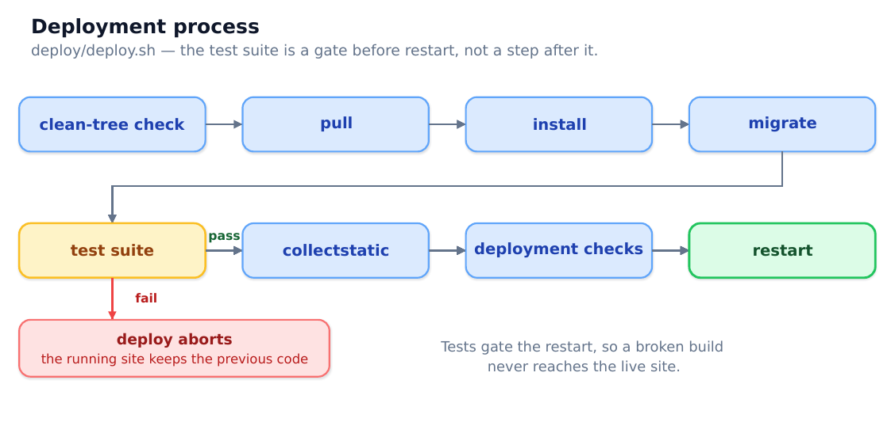

# Part 3 — Implementation

## Build order

Eleven milestones, each ending in a commit and a tag. The sequence was chosen so that the expensive-to-change decisions came first.

|  | Milestone | Delivered |
| --- | --- | --- |
| M0 | Scaffold | Env-driven settings, three models, admin, deploy configs |
| M1 | PostgreSQL everywhere | DATABASE_URL as the single lever, migrations from empty |
| M2 | Seed data | Idempotent management command, 17 systems / 14 employees / 14 requests |
| M3 | Read paths | Paginated list, detail, base template and stylesheet |
| M4 | Write paths | Create, edit, submit, withdraw — own drafts and pending only |
| M5 | Wizard | Four steps, session-backed, atomic commit |
| M6 | Dashboard and guards | Aggregation, approver queue, guarded decisions with concurrency |
| M7 | Test suite | 75 tests, every guard covered |
| M8 | Deployment | Gunicorn, nginx, TLS, deploy.sh |
| M9 | Demo hardening | Scheduled reset, demo banner, README review |
| M10 | Optional MFA | (optional; not built) |

Why PostgreSQL first. Moving database engine late is how engine-specific defects surface at the worst moment. The engine was settled before a single view existed.

Why seed data before the read paths. Building a list view against an empty table tells you nothing. Realistic data across every status made each subsequent milestone testable by looking at it.

Why the wizard after the plain write paths. The wizard is the harder path; the simple ModelForm route established the shape first.

Why tests at M7 rather than throughout. An honest note: the guards were verified by hand as they were built, but that verification vanished each time. Nothing protected against regression until M7. Test-first would have been better; consolidating at M7 was the actual sequence.

## The false start

The first scaffold contradicted its own specification on four counts: Django 6.0 instead of the pinned 5.2 LTS, differently named packages, python-dotenv instead of django-environ, and a live SQLite DATABASES block in a project whose stated rule was PostgreSQL everywhere. There was also no git repository at all, and the operating brief sat inside the intended repository root where a wildcard git add would have committed it.

It was deleted and rebuilt rather than patched. Four contradictions in a scaffold of that size is a signal the starting position is wrong, and correcting each one individually would have left the reasons undocumented.

The rebuild took roughly an hour and settled every conflict against the specification. The cost of that decision at M0 was small; at M5 it would have been a rewrite.

## Decision log

Decisions that were not obvious, with the reasoning that settled them.

Seeding is a management command, not a data migration or a fixture. A data migration re-runs against production on every deploy; fixtures need fixed primary keys that collide on re-seed. The command is idempotent and is what the scheduled demo reset calls.

approver means nominated, not “whoever decided”. The specification implied both. Only this reading satisfies all three requirements — the wizard chooses an approver, decisions stamp one, and the dashboard filters a queue by one. See Part 2.

Only the nominated approver may decide. Stricter than the specification said. Any other reading makes nomination meaningless and leaves the approver queue with no basis.

Withdrawal is a status change. Never a row delete. Evidence that disappears when someone changes their mind is not evidence.

Retired systems cut both ways. Excluded from the picker for new requests, still offered when editing a request that already references one — excluding them outright would silently drop the system on save and rewrite history.

The demo password comes from configuration. Published deliberately in the README; a working password committed to a tracked file would be published by accident.

reset_demo refuses unless DEMO_MODE is on. That guard is the entire safety of scheduling a destructive command: on a real deployment the flag is false, so a stray cron entry deletes nothing.

HSTS starts at one hour, not one year. Browsers cache it and refuse plain HTTP for the whole max-age regardless of what is served afterwards. A mistake at a year lasts a year.

## Testing

86 tests, roughly 23 seconds, PostgreSQL throughout.

| Area | Covers |
| --- | --- |
| Models | PROTECT on all three foreign keys, unique email, defaults |
| Access control | Every route in the URLconf redirects anonymous users |
| Write paths | Ownership and status guards, forgery of requested_by, POST-only actions |
| Guards | Self-approval, nominated approver, double-approval, decision stamps |
| Concurrency | Two threads racing one row; each guard layer in isolation |
| Wizard | Step guards, preserved answers, atomicity, abandonment |
| Dashboard | Counts, queue filtering, single-query aggregation |
| Demo | Reset guard and effect, banner visibility |
| Project config | No missing migrations, no SQLite, login redirect resolves |

Every guard has a test that fails when the guard is removed — verified by removing each one in turn and re-running. That exercise found a real gap: the self-approval and approver rules are each enforced twice, and removing only the deep half of the approver rule was caught by nothing, because the render-time check still refused. A test now pins that layer alone.

Three lessons worth recording:

Defence in depth needs a test per layer, or it quietly becomes defence in one layer.

The suite must state the settings it depends on. Enabling SECURE_SSL_REDIRECT for the deployment broke all 75 tests at once — the test client speaks HTTP, so every request was answered with a 301 before reaching a view. The application was right; the suite had silently inherited deployment configuration. Base test cases now pin what they rely on.

A drop in test count is a failure, even when nothing reports failed. An import error removes a module’s tests from the run silently; 75 quietly became 71 once.

## Deployment process

The tests run before the restart, not after. When the settings problem above broke the suite, the gate stopped the deploy and the live site kept serving the previous code. That ordering was a guess when it was written; it earned its keep the first time it ran.

Four configuration errors surfaced only on installing for real — a TLS block that certbot generates itself, a static alias that would have failed on directory permissions, a socket needing group ownership, and duplicated security headers. None were visible from reading the configuration.

## Commit protocol

- Nothing is committed or pushed without explicit approval. Reaching a milestone is not approval; passing tests is not approval.

- Commit and push are separate approvals.

- Pre-commit: tests pass, migrations included, .env not staged, no hostname, IP, real name or secret in any staged file, DEBUG not left true.

- Never stage with a wildcard. Every path is named explicitly.

- Imperative subject under ~70 characters, blank line, body explaining why.

- One commit per milestone unless the work genuinely splits.

- Each approved milestone is tagged.
